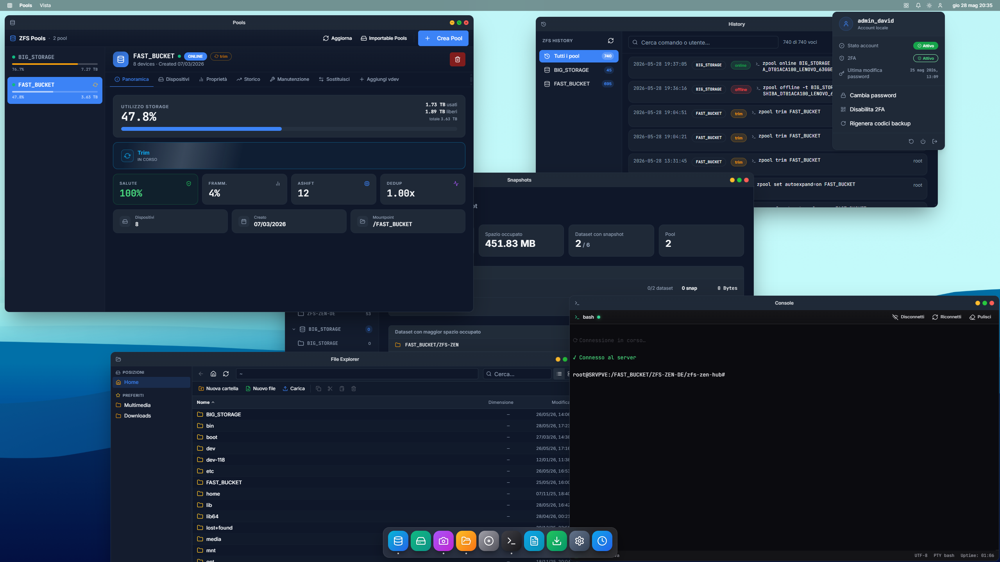

#  NexOS

A web-based management interface for Linux systems with ZFS storage. NexOS lets you administer your server entirely from a browser — no command line required.



---

## What it does

NexOS provides a unified control panel for the tasks that normally require juggling multiple CLI tools:

- **ZFS storage** — create and manage pools, datasets, volumes, and snapshots; run scrubs, TRIM, resilver, and replace operations
- **Disk management** — partition, format, mount, and unmount physical disks and USB drives; view SMART data and temperature history
- **File manager** — browse, upload, download, copy, move, rename, and archive files directly in the browser; built-in text editor
- **Restic backups** — schedule encrypted backups to local or remote repositories with pre/post script support; browse and restore snapshots
- **Network shares** — configure SMB and NFS exports; manage Samba users, groups, and global settings
- **Network mounts** — mount remote SMB/NFS resources and persist them across reboots
- **Download manager** — queue HTTP, magnet, and torrent downloads via aria2; manage active transfers in real time
- **Scheduler** — automate ZFS operations and dataset tasks with a cron-based scheduler
- **System monitoring** — live I/O, CPU, RAM, network, and ARC statistics via real-time streams
- **Console** — full interactive terminal session in the browser
- **Notifications** — event alerts delivered via Telegram or email; configurable per event type
- **Settings backup** — export and restore your entire NexOS configuration to an encrypted `.nexbak` file
- **Updates** — check for and install new releases directly from the interface

---

## Who it is for

NexOS is designed for anyone running a Linux server with ZFS who wants a clean web interface instead of a terminal. It works equally well on a home NAS, a Proxmox host, or a dedicated server.

---

## Security

NexOS is built with security as a first-class requirement.

- **Authentication** — bcrypt password hashing with timing-attack-resistant verification; session tokens with short-lived JWT access tokens and automatic sliding refresh
- **Two-factor authentication** — TOTP (compatible with any authenticator app) with QR code setup, backup codes, and brute-force lockout
- **CSRF protection** — every mutating endpoint requires a one-time ticket in addition to a valid session; tickets are consumed on first use
- **Encryption at rest** — sensitive database fields (credentials, API tokens, TOTP secrets) are encrypted with a Fernet key stored separately from the database
- **TLS** — native HTTPS with self-signed or custom certificates, or reverse-proxy mode for deployments behind nginx/Caddy/Traefik
- **HTTP security headers** — CSP, HSTS, X-Frame-Options, X-Content-Type-Options, Referrer-Policy, Permissions-Policy
- **Host validation** — configurable allowed origins; requests from unlisted hosts are rejected before any processing
- **WebSocket security** — short-lived ticket authentication (5-second TTL) with periodic session revalidation every 60 seconds; single session per user
- **Package integrity** — the installer verifies every file in the release package against Ed25519 signatures before writing anything to disk; tampered or incomplete packages are rejected

---

## Compatibility

| Distribution | Status |
|---|---|
| Proxmox VE 7+ | ✅ Tested |
| Debian 11+ | ✅ Tested |
| Ubuntu 22.04+ | ✅ Tested |
| Fedora 39+ | ✅ Potentially compatible |
| Arch Linux | ✅ Potentially compatible |

Any Linux distribution with systemd and OpenZFS should work.

---

## Requirements

- Linux with **systemd**
- **ZFS** kernel modules (OpenZFS)
- **root** access (required for ZFS and disk operations)
- A modern browser

Optional:
- `aria2` for the download manager (`apt install aria2` / `dnf install aria2`)
- `restic` for backups (the interface can install it automatically)

---

## Installation

**1. Download the latest release**

Go to the [Releases](../../releases/latest) page and download `nexos.tar.gz`.

```bash
wget https://github.com/MaxlonPlay/NexOS/releases/download/latest/nexos.tar.gz
```

**2. Extract**

```bash
tar -xzf nexos.tar.gz
cd nexos
```

**3. Run the installer**

```bash
./install
```

The installer will guide you through a short wizard:

| Step | What it asks |
|------|-------------|
| Connection mode | Native HTTPS · HTTPS via reverse proxy · Plain HTTP |
| Certificate | Auto-generate self-signed or provide your own cert/key |
| Port | Listening port (default: `8000`) |
| File manager root | Which path to expose (default: `/`) and protection mode |
| Allowed origins | Restrict access to specific hostnames or IPs (optional) |

When finished, NexOS is installed as a systemd service and starts automatically.

**4. Open the interface**

Navigate to the address shown at the end of the installer (e.g. `https://your-server:8000`).  
On first login you will be prompted to create your admin credentials.

---

## Managing the service

```bash
systemctl status nexos      # current status and memory usage
systemctl restart nexos     # restart
systemctl stop nexos        # stop
journalctl -u nexos -f      # live logs
```

---

## Configuration

The configuration file is located at `/usr/lib/nexos/.env`. You can edit it manually and restart the service to apply changes.

```bash
nano /usr/lib/nexos/.env
systemctl restart nexos
```

### TLS / HTTPS

| Variable | Default | Description |
|---|---|---|
| `HTTPS_ENABLED` | `true` | Enable HTTPS |
| `SECURE_COOKIES` | `true` | Mark session cookies as Secure (set to `false` for plain HTTP) |
| `AUTO_SSL` | `true` | Auto-generate a self-signed certificate |
| `SSL_CERTFILE` | — | Path to a custom certificate PEM file |
| `SSL_KEYFILE` | — | Path to the matching private key PEM file |
| `SSL_HOSTNAME` | — | Extra IPs or hostnames to include in the self-signed cert SAN |

### Access control

| Variable | Default | Description |
|---|---|---|
| `ALLOWED_ORIGINS` | *(any)* | Comma-separated hostnames or IPs allowed to connect; requests from unlisted hosts are rejected |
| `TRUSTED_PROXY` | `false` | Set to `true` when running behind a reverse proxy (nginx, Caddy, Traefik) to trust `X-Forwarded-For` |

### File manager

| Variable | Default | Description |
|---|---|---|
| `FILE_ROOT` | `/` | Root path exposed in the file manager |
| `FILE_ROOTS` | — | Alternative to `FILE_ROOT`: comma-separated list of paths for multi-root mode |
| `FILE_MANAGER_PROTECTION` | `strict` | `strict` blocks writes to system paths; `permissive` allows editing anywhere under the root |

### Downloads

| Variable | Default | Description |
|---|---|---|
| `DOWNLOAD_SAVE_PATH` | `/var/lib/nexos/downloads` | Default save directory for downloads |
| `DOWNLOAD_MAX_CONCURRENT` | `4` | Maximum simultaneous downloads |
| `DOWNLOAD_MAX_CONNECTIONS` | `4` | Maximum connections per download |

### Terminal

| Variable | Default | Description |
|---|---|---|
| `CONSOLE_SHELL` | `/bin/bash` | Shell to launch in the browser terminal |
| `CONSOLE_IDLE_TIMEOUT` | `1800` | Seconds of inactivity before the session is closed |
| `CONSOLE_MAX_SESSION` | `3600` | Maximum session lifetime in seconds |
| `CONSOLE_TOKEN_REVALIDATION` | `60` | How often (in seconds) the session token is re-checked |

### Paths

| Variable | Default | Description |
|---|---|---|
| `NEXOS_DATA_DIR` | `/var/lib/nexos` | Directory for the database, scripts, and runtime data |
| `NFS_EXPORTS_FILE` | `/etc/exports` | Path to the NFS exports file |

### Security

| Variable | Description |
|---|---|
| `DATA_ENCRYPTION_KEY` | Fernet key used to encrypt sensitive database fields (2FA secrets, credentials). **Do not lose or change this key** — doing so will make all encrypted data permanently unreadable. Back it up alongside your database. |

---

## Reinstalling or reconfiguring

Running the installer again on an existing installation will walk through the same wizard while preserving your current values — press Enter to keep any setting unchanged. Your database and encryption key are never touched during a reinstall.

---

## License

[AGPL-3.0-or-later](LICENSE)
