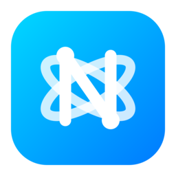
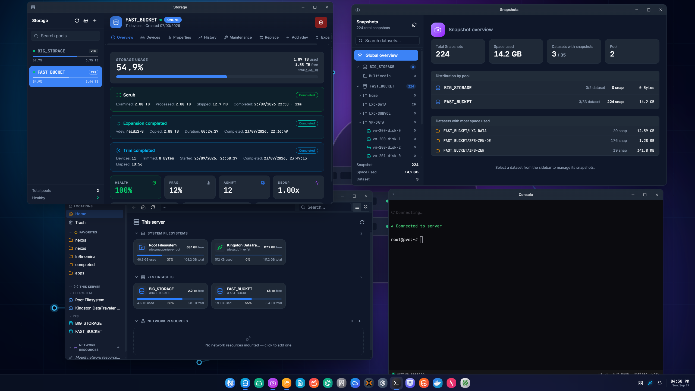

#  NexOS

NexOS is a web-based management platform for Linux servers designed to simplify and centralize your storage administration. Configure and monitor your infrastructure directly from the browser: whether using ZFS, software RAID with mdadm, LVM, or filesystems like ext4 and Btrfs (coming soon), manage every layer without touching the command line.



---

## What it does

NexOS provides a unified control panel for the tasks that normally require juggling multiple CLI tools:

- **Storage management** — create and manage ZFS pools, mdadm software RAID arrays, LVM volume groups, and logical volumes; format and mount ext4 and Btrfs (coming soon) filesystems; handle ZFS datasets, snapshots, scrubs, TRIM, resilvering, and disk replacements
- **Disk management** — partition, format, mount, and unmount physical disks and USB drives; view SMART data and temperature history
- **App Store** — discover, install, and manage native apps built specifically for the NexOS platform
- **Multi-user & Granular Permissions** — support for admin and standard users with fine-grained, fully customizable permission controls for admin roles (not just all-or-nothing access)
- **Network shares** — easily configure simple network shares via SMB and NFS; manage Samba users, groups, and global settings
- **Network mounts** — mount remote SMB/NFS resources and persist them across reboots
- **File manager** — browse, upload, download, copy, move, rename, and archive files directly in the browser; built-in text editor
- **Restic backups** — schedule encrypted backups to local or remote repositories with pre/post script support; browse and restore snapshots
- **Download manager** — queue HTTP, magnet, and torrent downloads via aria2; manage active transfers in real time
- **Scheduler** — automate storage maintenance operations and tasks with a cron-based scheduler
- **System monitoring** — live I/O, CPU, RAM, network, and ARC statistics via real-time streams
- **Console** — full interactive terminal session in the browser
- **Real-time notifications** — instant event alerts delivered via email or your own custom Telegram bot, with per-event configuration
- **Settings backup** — export and restore your entire NexOS configuration to an encrypted `.nexbak` file
- **Updates** — check for and install new releases directly from the interface

---

## Who it is for

NexOS is built for anyone running a Linux server who wants a clean, modern web interface instead of relying on the terminal. Whether you are managing complex ZFS pools, mdadm software RAID, LVM volumes, or standard filesystems, NexOS fits seamlessly on a home NAS, a Proxmox host, a home lab, or a dedicated bare-metal server.

---

## Security

NexOS is built with security as a first-class requirement.

- **Authentication** — bcrypt password hashing with timing-attack-resistant verification; session tokens with short-lived JWT access tokens and automatic sliding refresh
- **Two-factor authentication** — TOTP (compatible with any authenticator app) with QR code setup, backup codes, and brute-force lockout
- **CSRF protection** — every mutating endpoint requires a one-time ticket in addition to a valid session; tickets are consumed on first use
- **Encryption at rest** — sensitive database fields (credentials, API tokens, TOTP secrets) are encrypted with a Fernet key stored separately from the database
- **TLS** — native HTTPS with self-signed or custom certificates, or reverse-proxy mode for deployments behind nginx/Caddy/Traefik
- **HTTP security headers** — CSP, HSTS, X-Frame-Options, X-Content-Type-Options, Referrer-Policy, Permissions-Policy
- **Host validation** — configurable allowed origins; requests from unlisted hosts are rejected before any processing
- **WebSocket security** — short-lived ticket authentication (5-second TTL) with periodic session revalidation every 60 seconds; single session per user
- **Package integrity** — the installer verifies every file in the release package against Ed25519 signatures before writing anything to disk; tampered or incomplete packages are rejected

---

## Compatibility

| Distribution | Status |
|---|---|
| Proxmox VE 9+ | ✅ Tested |
| Debian 13+ | ✅ Tested |
| Ubuntu 24.04+ | ✅ Tested |
| Fedora 42+ | ✅ Potentially compatible |
| Arch Linux | ✅ Potentially compatible |

Any Linux distribution with systemd should work.

---

## Requirements

- Linux with **systemd**
- **root** access (required for ZFS/MDADM and disk operations)

---

## Installation

**1. Download the latest release**

Go to the [Releases](../../releases/latest) page and download `nexos.tar.gz`.

```bash
wget https://github.com/MaxlonPlay/NexOS/releases/download/latest/nexos.tar.gz
```

**2. Extract**

```bash
tar -xzf nexos.tar.gz
cd nexos
```

**3. Run the installer**

```bash
./install
```

The installer will guide you through a short wizard:

| Step | What it asks |
|------|-------------|
| Connection mode | Native HTTPS · HTTPS via reverse proxy · Plain HTTP |
| Certificate | Auto-generate self-signed or provide your own cert/key |
| Port | Listening port (default: `8000`) |
| File manager | protection mode |

When finished, NexOS is installed as a systemd service and starts automatically.

**4. Open the interface**

Navigate to the address shown at the end of the installer (e.g. `https://your-server:8000`).  
On first login you will be prompted to create your admin credentials.

---

## Managing the service

```bash
systemctl status nexos      # current status and memory usage
systemctl restart nexos     # restart
systemctl stop nexos        # stop
```

---

## Configuration

The configuration file is located at `/usr/lib/nexos/.env`. You can edit it manually and restart the service to apply changes.

```bash
nano /usr/lib/nexos/.env
systemctl restart nexos
```

### TLS / HTTPS

| Variable | Default | Description |
|---|---|---|
| `AUTO_SSL` | `true` | Auto-generate a self-signed certificate |
| `SSL_HOSTNAME` | `local ip server` | Automatically detected |
| `SSL_CERTFILE` | — | Path to a custom certificate PEM file |
| `SSL_KEYFILE` | — | Path to the matching private key PEM file |
| `SSL_HOSTNAME` | — | Extra IPs or hostnames to include in the self-signed cert SAN |

### File manager

| Variable | Default | Description |
|---|---|---|
| `FILE_MANAGER_PROTECTION` | `strict` | `strict` blocks writes to system paths; `permissive` allows editing anywhere under the root |

### Terminal

| Variable | Default | Description |
|---|---|---|
| `CONSOLE_SHELL` | `/bin/bash` | Shell to launch in the browser terminal |
| `CONSOLE_IDLE_TIMEOUT` | `1800` | Seconds of inactivity before the session is closed |
| `CONSOLE_TOKEN_REVALIDATION` | `60` | How often (in seconds) the session token is re-checked |

### Security

| Variable | Description |
|---|---|
| `DATA_ENCRYPTION_KEY` | Fernet key used to encrypt sensitive database fields (2FA secrets, credentials). **Do not lose or change this key** — doing so will make all encrypted data permanently unreadable. Back it up alongside your database. |

---

## Reinstalling or reconfiguring

Running the installer again on an existing installation will walk through the same wizard while preserving your current values — press Enter to keep any setting unchanged. Your database and encryption key are never touched during a reinstall.

---

## License

[AGPL-3.0-or-later](LICENSE)
